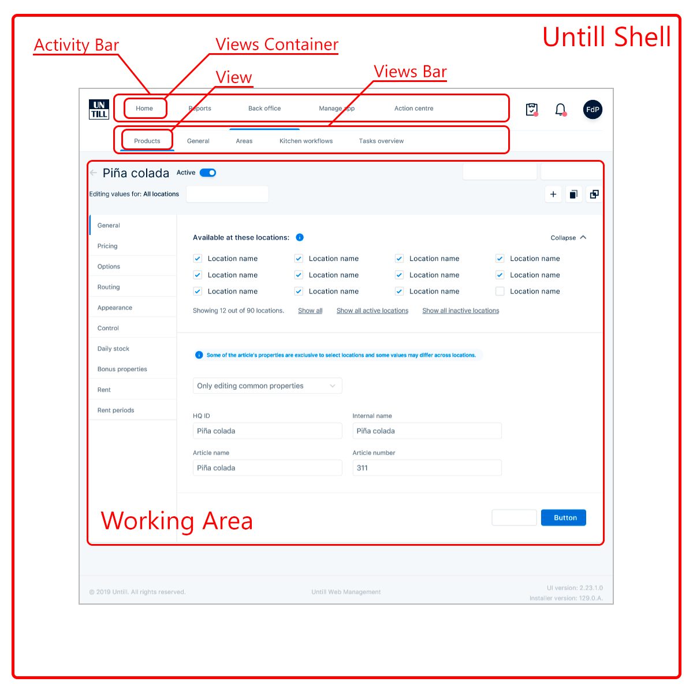

# Terminology

 

1. `Untill Air Shell` or just `Shell` - managment tool for `Untill Air POS` application, that allows users to:
    - Manage Back-office data
    - Generate reports
    - Manage application
    - Manage tasks
    - Use different custom `Views` to achive needed functionality.
1. `Activity bar` - main navigation block of `Shell`. Contains a list of `Views Container` or `View`.
1. `Views Container` - `Shell` plugin that provides some functionality and instruments to iteract with back office database using `Shell API`. If `Views Container` does not contain` View`, then it is `View` itself.
1. `Views Bar` - List of `Views` for current `Views Container`
1. `View` - element of `Views Bar`. Represents some separated logical part (section) of `Views Container`.
1. `Working Area` - displays content of current `View`.
 
 
**`Shell API`** - a set of JavaScript methods, available to each `View`, that provides all necessary instruments to itteract with backoffice database.

